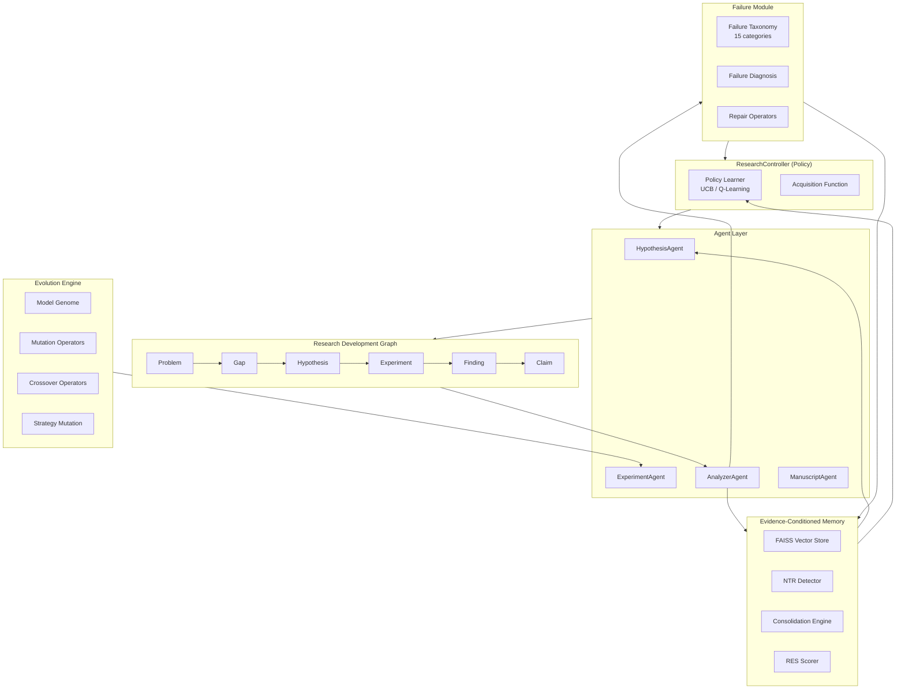
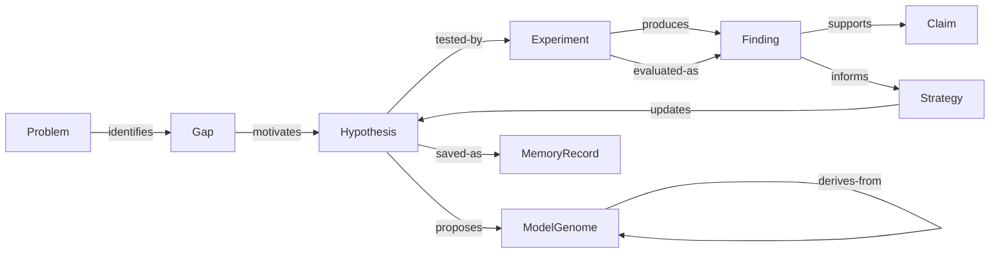
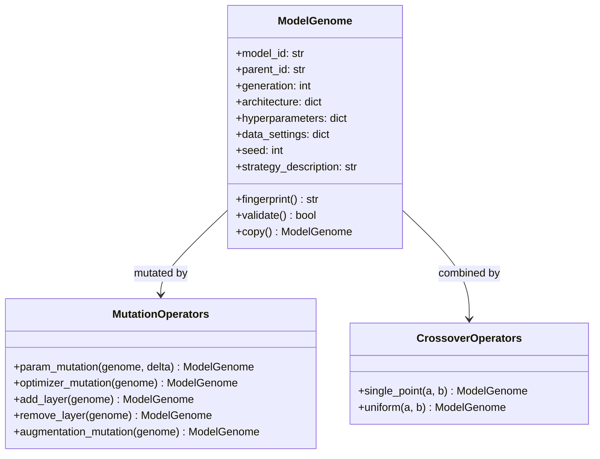
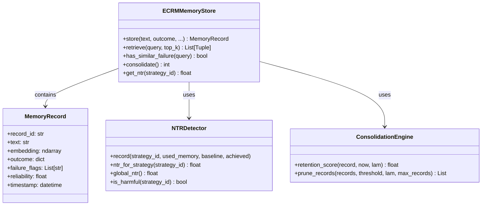

# ResearchForge-ECRM

**Evidence- and Outcome-Conditioned Research Memory for Autonomous Model Evolution**

ResearchForge-ECRM is a multi-agent framework that autonomously discovers, tests, remembers, and evolves ML research hypotheses. It uniquely treats memory as an active control policy (not passive RAG) and failure taxonomy as a first-class citizen.

---

## Key Novelties

| Feature | Description |
|---|---|
| **Research Development Graph (RDG)** | Typed directed graph linking Problems -> Gaps -> Hypotheses -> Experiments -> Findings -> Claims |
| **ECRM** | Evidence- and Outcome-Conditioned Research Memory with exponential retention decay and NTR detection |
| **Failure Taxonomy** | 15-category diagnostic system with automated repair operators |
| **Model Genome** | JSON-schema-validated encoding of architecture + hyperparameters + strategy |
| **SeaEvo Strategy-Space Evolution** | Natural-language strategy descriptions evolve alongside model code |
| **UCB + RL Policy** | Bandit and Q-learning policies for intelligent branch selection |
| **RDE-Bench** | 7-metric benchmark suite (RE, SE, FRR, NTR, MU, half-life, RRS) |

---

## System Architecture



---

## Project Structure

```
Research_model/
|-- config/
|   `-- settings.py            # Pydantic settings (env-driven)
|-- rdg/
|   |-- nodes.py               # RDG node types (Problem, Gap, Hypothesis...)
|   |-- edges.py               # Typed edges with semantic constraints
|   |-- consistency.py         # Edge semantic validation
|   |-- graph.py               # Core RDG (NetworkX-backed)
|   `-- neo4j_client.py        # Optional Neo4j sync
|-- ecrm/
|   |-- embedder.py            # Sentence-Transformer embeddings (+ fallback)
|   |-- memory_store.py        # FAISS-backed ECRM store
|   |-- res_scorer.py          # Research Experience Score (RES)
|   |-- negative_transfer.py   # NTR detector
|   `-- consolidation.py       # Retention decay & pruning
|-- evolution/
|   |-- genome.py              # ModelGenome (JSON-schema validated)
|   |-- mutate.py              # 5 mutation operators
|   |-- crossover.py           # Single-point & uniform crossover
|   |-- strategy_mutation.py   # SeaEvo strategy-space evolution
|   `-- operators.py           # Operator registry
|-- policy/
|   |-- acquisition.py         # UCB acquisition function
|   |-- bandit.py              # UCB1 + Thompson Sampling
|   `-- rl_policy.py           # Tabular Q-Learning
|-- failure/
|   |-- taxonomy.py            # 15-category failure taxonomy
|   |-- diagnosis.py           # Automated failure diagnosis
|   `-- repair.py              # Repair operators
|-- agents/
|   |-- base_agent.py          # LLM wrapper (OpenAI/Anthropic/mock)
|   |-- hypothesis_agent.py    # Memory-conditioned hypothesis generation
|   |-- experiment_agent.py    # Code generation + execution
|   |-- analyzer_agent.py      # RDG + ECRM update on results
|   |-- controller_agent.py    # Full research loop orchestrator
|   `-- manuscript_agent.py    # Research summary generation
|-- benchmarks/
|   |-- metrics.py             # 7 RDE-Bench metrics
|   |-- evaluator.py           # Multi-task benchmark runner
|   `-- tasks/
|       |-- cifar10_task.py    # Vision track (CIFAR-10)
|       |-- ecg_task.py        # Healthcare track (MIT-BIH ECG)
|       `-- synthetic_task.py  # Synthetic time-series
|-- tools/
|   |-- openalex.py            # OpenAlex literature retrieval
|   |-- semantic_scholar.py    # Semantic Scholar API
|   |-- arxiv_search.py        # arXiv preprint search
|   `-- mlflow_tracker.py      # MLflow experiment tracking
|-- api/
|   `-- main.py                # FastAPI REST API
|-- db/
|   `-- migrations/
|       `-- 001_initial.sql    # PostgreSQL schema
|-- schemas/
|   `-- rdg_schema.json        # RDG JSON Schema
|-- tests/
|   |-- test_rdg.py            # RDG unit tests
|   |-- test_ecrm.py           # ECRM unit tests
|   |-- test_evolution.py      # Evolution unit tests
|   `-- test_integration.py    # Full-loop integration tests
|-- main.py                    # CLI entrypoint (Click + Rich)
|-- requirements.txt
|-- Dockerfile
|-- docker-compose.yml
|-- pytest.ini
|-- .env.example
`-- LICENSE
```

---

## RDG Node & Edge Ontology



---

## Model Genome



---

## ECRM Memory System



---

## RDE-Bench Metrics

| Metric | Formula | Target |
|---|---|---|
| **Research Efficiency (RE)** | Sum(gains) / Sum(costs) | Maximize |
| **Search Efficiency (SE)** | Evaluations until first improvement | Minimize |
| **Failure Repetition Rate (FRR)** | #repeated_failures / #failures | Minimize (<0.1) |
| **Negative Transfer Rate (NTR)** | #harmful_memory_uses / #memory_uses | Minimize (<0.3) |
| **Memory Utility (MU)** | mean(with_memory) - mean(without) | Maximize |
| **Memory Half-Life** | log(2) / lambda (days) | Context-dependent |
| **Research Reliability Score (RRS)** | #supported_claims / #claims | Maximize (>0.8) |

---

## Quick Start

### 1. Install

```bash
cd "Research_model"
pip install -r requirements.txt
```

### 2. Configure

```bash
cp .env.example .env
# Edit .env and set LLM_PROVIDER=openai and OPENAI_API_KEY=sk-...
# For offline/demo mode, keep LLM_PROVIDER=mock
```

### 3. Run Demo

```bash
python main.py demo
```

### 3a. Run real offline training (recommended first verification)

This command does not download data or execute LLM-generated code. It trains
and evaluates scikit-learn estimators on the bundled handwritten-digits data,
using a separate validation and held-out test partition inside the task
adapter.

```bash
python main.py real-demo --iterations 7
```

The reference run is deterministic (`seed=42`) and should reach a validation
accuracy above 0.90 after the plateau-triggered SVC discovery branch. This is
evidence that the experiment engine performs real `fit`/`predict` evaluation;
it is not a claim that the framework has been fine-tuned on your future
domain data. Add a task adapter for ECG, Sentinel, or CIFAR data before making
domain-specific performance claims.

### 4. Start Research Loop

```bash
# Mock mode (fast, no API key required)
python main.py run --problem "Improve CIFAR-10 accuracy" --iterations 20 --mock

# Real LLM mode
python main.py run --problem "Discover novel optimizers for ResNets" --iterations 50 --no-mock
```

### 5. Run Benchmarks

```bash
python main.py benchmark --tasks cifar10,synthetic --iterations 20
```

### 6. Start REST API

```bash
python main.py api --port 8000
# Swagger docs: http://localhost:8000/docs
```

### 7. Run Tests

```bash
pytest tests/ -v
```

## Memory retention policy

ECRM is not an unrestricted experiment log. It retains only (1) a failed
attempt and its diagnosis, or (2) a successful intervention that improves on
the decision-time baseline. Neutral repetitions are discarded. This keeps
retrieval focused on reusable positive and negative evidence, while the RDG
remains the complete provenance record for every experiment.

The default embedding path is a deterministic token-and-bigram hashing
encoder, so offline runs never download a model. To use a locally provisioned
sentence-transformer, set `RESEARCHFORGE_USE_LOCAL_ENCODER=1`; the same ECRM
interface is preserved.

---

## Docker Deployment

```bash
# Full stack (API + PostgreSQL + Neo4j + MLflow)
docker-compose up -d

# API only
docker build -t researchforge .
docker run -p 8000:8000 researchforge
```

---

## REST API Endpoints

| Method | Endpoint | Description |
|---|---|---|
| `GET` | `/health` | System health check |
| `POST` | `/research/start` | Start research loop |
| `GET` | `/rdg/stats` | RDG statistics |
| `GET` | `/rdg/nodes` | List all RDG nodes |
| `GET` | `/rdg/nodes/{id}` | Get specific node |
| `POST` | `/models/mutate` | Apply evolution operator |
| `POST` | `/memory/store` | Store memory record |
| `POST` | `/memory/query` | Semantic memory search |
| `GET` | `/memory/stats` | Memory statistics |
| `POST` | `/memory/consolidate` | Run memory pruning |

---

## Configuration Reference

All settings in `config/settings.py` are overridable via `.env`:

| Variable | Default | Description |
|---|---|---|
| `LLM_PROVIDER` | `mock` | `openai`, `anthropic`, or `mock` |
| `OPENAI_API_KEY` | - | OpenAI API key |
| `NEO4J_ENABLED` | `false` | Enable Neo4j graph persistence |
| `MEMORY_RETAIN_LAMBDA` | `0.01` | Forgetting rate (higher = forget faster) |
| `NTR_THRESHOLD` | `0.3` | NTR above this disables memory for strategy |
| `POLICY_TYPE` | `ucb` | Branch selection: `ucb`, `thompson`, or `rl` |
| `UCB_C` | `1.41` | UCB exploration constant |
| `EVOLUTION_PLATEAU_THRESHOLD` | `5` | Stuck iterations before algorithm discovery |

---

## License

MIT License - see [LICENSE](LICENSE).

---

## Citation

If you use ResearchForge-ECRM in academic work, please cite:

```bibtex
@software{researchforge_ecrm_2025,
  title  = {ResearchForge-ECRM: Evidence- and Outcome-Conditioned Research Memory 
             for Autonomous Model Evolution},
  year   = {2025},
  url    = {https://github.com/lokesh-poreddy/Research_model}
}
```
