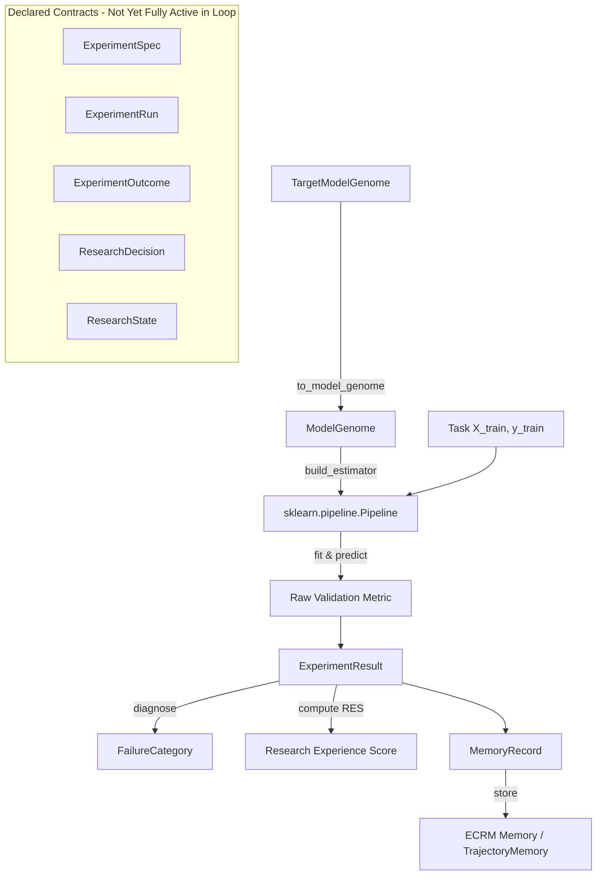

## ALPHA3 ARCHITECTURE AUDIT

This document captures a snapshot audit of the repository state prior to any
behavioral changes for RF-1.0.0-alpha.3. It is intentionally factual: it does
not change code or runtime behavior. Use this file as the authoritative Phase 0
artifact prior to implementation work.

---

**A. Current component inventory**
- Top-level: CHANGELOG.md, README.md, Dockerfile, docker-compose.yml, requirements.txt, pytest.ini
- `researchforge/`: canonical RF-1 implementation (core domain, experiment, memory, benchmarks, rdg/ modules)
- `researchforge/benchmarks/`: RDE-Bench: `rde_bench.py`, tasks and evaluator
- `researchforge/experiment/`: specs, runs, outcomes, trajectory (existing); (will be strengthened)
- `researchforge/memory/` and `ecrm/`: ECRM implementations and memory_store
- `researchforge/policy/` and top-level `policy/`: policy implementations (UCB baseline)
- `researchforge/rdg` and `schemas/rdg_schema.json`: RDG typing and schema
- `researchforge/api/` and top-level `api/`: API server front-end (FastAPI)
- `agents/`, `Research_model/`, `researchforge_ecrm/`: compatibility and legacy copies preserved for evidence
- `docs/`: architecture docs and design materials
- `tests/`: comprehensive test suites (CORE, COMPATIBILITY, LEGACY markers)

**B. Imports / dependencies**
- Primary dependencies in `requirements.txt`: `numpy`, `scikit-learn`, `fastapi`, `uvicorn`, `pydantic`, optional `httpx`, `matplotlib`.
- `Dockerfile` installs Python 3.11-slim and system deps (`build-essential`, `libpq-dev`, `git`) before installing `requirements.txt`.
- Test and CI depend on `pytest` and `pytest.ini` markers.

**C. Canonical vs compatibility vs legacy status**
- Canonical (`researchforge/`): domain objects, experiments, memory, evaluators, validity checks — treat as authoritative RF-1 implementation.
- Compatibility/Adapters: `agents/`, `researchforge_ecrm/`, `Research_model/` — compatibility layers, historical snapshots, or example integrations.
- Legacy artifacts: `Research_model/` snapshot, `matlab_data/` exports, and generated `demo_results.json` — preserved as research evidence.

**D. Data-flow map**
- Datasets/tasks (`benchmarks/tasks`) -> Candidate generation (`genome`, `evolution`) -> Decision & spec (controller + policy) -> Execution (runner / evaluator) -> Outcome -> Validity gate -> Memory update (ECRM) -> Persistent VRDEG/Artifacts.

**E. Execution-flow map**
- CLI / Controller (`main.py`, `run_demo.py`) orchestrates: build task -> generate candidates -> select via policy -> produce `ExperimentSpec` -> execute -> evaluate -> update memory/state.

**F. Research-state-flow map**
- Current implicit state: controller-held best-so-far + memory snapshots in `memory_store`.
- Planned alpha.3 explicit `ResearchState` will serialize: problem id, questions, hypotheses, active RSG, candidate TMGs, selected TMG, recent experiment refs, evidence refs, failures, memory context, best-known result, budget accounting, policy state, provenance links, and state fingerprint.

**G. Benchmark-flow map**
- RDE-Bench (`researchforge/benchmarks/rde_bench.py`) invoked by `run_demo.py` and `main.py` demo paths.
- Persistent artifacts: `demo_results.json`, `RF0_vs_RF1_regression.json`, `matlab_data/*.mat`.

**H. Safety boundaries**
- Present: process-level timeouts/termination and evaluator checks.
- Missing: fine-grained filesystem/network policies, resource cgroups, enforced container isolation. Docker images exist to run in containers, but code-level enforcement is coarse.

**I. Provenance boundaries**
- Present: seeds, specs, and result dumps in JSON/MAT for many runs.
- Missing/planned: content-addressed artifact ids, VRDEG node/edge persistence, canonical fingerprints for RSG/TMG/Spec/Run/Outcome linked across layers.

**J. Current known scientific limitations**
- Documented: static trajectory-memory under-sampling and context fragmentation reduced empirical utility in prior experiments.
- Partial provenance and decision traceability limit reproducibility and causal credit assignment today.

**K. Current benchmark artifacts**
- `demo_results.json` (project root)
- `RF0_vs_RF1_regression.json` (project root)
- `matlab_data/rde_bench_results.mat`, `digits_task.mat`, `synthetic_ecg_task.mat`

**L. Unresolved inconsistencies**
- Multiple repository snapshots / copies (`Research_model/`, `researchforge_ecrm/`) coexist for evidence and historical runs — must be carefully reconciled.
- Adapter capabilities not declared in a machine-readable manifest; adapter health/capability matrix missing.

**M. Exact files that will change in alpha.3 (planned, non-exhaustive)**
- `researchforge/state/research_state.py` (new/strengthen)
- `researchforge/decision/decision.py` (new/strengthen)
- `researchforge/experiment/spec.py`, `run.py`, `outcome.py`, `runner.py` (strengthen / new runner)
- `researchforge/safety/policy.py` (new)
- `researchforge/vrdeg/*` (new folder: schema.py, nodes.py, edges.py, graph.py, provenance.py, queries.py, lineage.py)
- `researchforge/memory/adaptive_trajectory.py` (new)
- `researchforge/evidence/normalization.py`, `claims.py`, `provenance.py` (new)
- `researchforge/policy/research_policy.py`, `portfolio.py`, `saturation.py` (new)
- `researchforge/adapters/manifest.json` (new)
- `researchforge/benchmarks/research_continuity.py` (new)
- `docs/ALPHA3_ARCHITECTURE_AUDIT.md` (this file)

---

Notes and next steps
- This audit intentionally mirrors the Phase 0 freeze requirement. No runtime behavior modified.
- Next: begin Phase 1 (canonical domain contracts) and implement `ResearchState` contract as an immutable, versioned object.

Generated by repository inspection on 2026-09-05.
# RF-1.0.0-alpha.3 Architecture Audit & Scientific State Baseline

**Document:** `docs/ALPHA3_ARCHITECTURE_AUDIT.md`  
**Target Release:** RF-1.0.0-alpha.3  
**Current Release:** RF-1.0.0-alpha.2.1  
**Current Git Commit:** `bc9a28a343c2d135017be0b0a8825c09d7b99262`  
**Current Git Tag:** `v5`  
**Test Baseline:** 269 passing tests (171 CORE, 51 COMPATIBILITY, 47 LEGACY, 0 failures, 2 warnings)  
**Regression Status:** Verified (mean absolute delta = 0.00000000; bitwise trajectory equivalence)  
**Timestamp:** 2026-09-05T14:25:00+05:30  

---

## Executive Summary & Scientific Purpose

This audit freezes and evaluates the complete architecture of ResearchForge-ECRM at the boundary between RF-1.0.0-alpha.2.1 and RF-1.0.0-alpha.3. 

The central scientific objective for alpha.3 is:
> *"Can complete experimental experience be converted into persistent, provenance-aware research state that reliably influences future research decisions?"*

In alpha.2.1, the dual-stack codebase was converged into a single canonical namespace (`researchforge/`) with 14 canonical contract schemas, a migrated controller population (`List[TargetModelGenome]`), a 4-scope configuration hierarchy, and an AST-enforced cross-stack boundary. However, the runtime loop still operates with pieces disconnected: experiments are executed directly in the controller rather than through a unified `ExperimentRunner`, `ResearchState` records history passively rather than driving decisions through a formal transition cycle, RDG remains an untyped in-memory graph rather than a Versioned Research Development and Evidence Graph (VRDEG), and trajectory memory remains vulnerable to evidence sparsity because adaptive contextual backoff has not yet been implemented.

This audit documents every component, data flow, boundary, limitation, and required change prior to writing any alpha.3 implementation code.

---

## A. Current Component Inventory

### 1. Canonical Namespace (`researchforge/`)
* **`researchforge/genome/`**:
  * `target_model_genome.py`: Class A immutable `TargetModelGenome` (TMG). Encapsulates model architecture, hyperparameters, data pipeline, capabilities (`TMGCapabilities`), lineage (`parent_ids`, `ancestor_ids`, `crossover_parents`), deterministic collision-safe `tmg_id`, and `to_model_genome()` bridge.
  * `research_system_genome.py`: Class A immutable `ResearchSystemGenome` (RSG). Encapsulates research policy, operator portfolio, `ExecutionConfig`, `OperatorConfig`, `TerminationConfig`, `ResearchMemoryConfig`, `ResearchValidityConfig`, and `ResearchRetrievalConfig`. Evolved via `RSG.evolve()` across 11 meta-operators.
  * `model_genome.py`: Baseline `ModelGenome` providing scikit-learn `Pipeline` instantiation (`build_estimator()`) and pre-flight bounds checking (`safety_check()`).
  * `operators.py`: TMG evolution operators (`STRATEGIES`: `increase_capacity`, `decrease_capacity`, `change_family`, `tune_hyperparameters`, `change_pipeline`, `crossover_top2`, `mutate_random`) and `apply_strategy()` dispatcher.
  * `schema.py`: JSON Schema validators (`validate_genome`), deterministic genome ID hashing (`deterministic_genome_id`), and canonical JSON SHA-256 fingerprinting (`genome_fingerprint`).
  * `migration.py`: Lossless upgrade and downgrade utilities between legacy `ModelGenome` and canonical `TargetModelGenome`.

* **`researchforge/experiment/`**:
  * `spec.py`: Class A immutable `ExperimentSpec`. Defines intended execution parameters, including `tmg_fingerprint`, `dataset_fingerprint`, `data_pipeline_fingerprint`, `evaluator`, `metric_fn`, `seed`, and `validity_config_fingerprint`.
  * `run.py`: Class A immutable `ExperimentRun`. Records actual execution parameters, timing, runner version, resource usage, safety outcome, and artifact references.
  * `outcome.py`: Class A immutable `ExperimentOutcome`. Captures scientific results, measured metrics, baseline comparison, failure category, and validity verdict.
  * `trajectory.py`: `TrajectoryFingerprint` and `compute_trajectory_fingerprint()`. Hashes deterministic trial content to verify trajectory equivalence across releases.

* **`researchforge/state/`**:
  * `research_state.py`: Class D binding object `ResearchState`. Captures research state at generation $t$, including `generation`, `research_phase`, `active_rsg_id`, `candidate_tmg_ids`, `best_metric`, `budget_remaining`, and reference IDs to evidence, outcomes, and failures.

* **`researchforge/decision/`**:
  * `decision.py`: Class A immutable `ResearchDecision`. Initial alpha.2.1 schema capturing `decision_id`, `decision_type`, `context_state_id`, `rationale`, `chosen_option`, `candidate_options`, and `policy_confidence`.

* **`researchforge/evidence/`**:
  * `evidence.py`: Class A immutable `Evidence` (adjudicated, citable evidence) and `EvidenceCandidate` (raw retrieved candidate items).

* **`researchforge/artifact/`**:
  * `artifact.py`: Class A immutable `Artifact` and `Provenance`. Provides content-addressed tracking of serialized models, datasets, reports, logs, and plots.

* **`researchforge/diagnosis/`**:
  * `failure.py`: Class A immutable `Failure` artifact. Records `failure_id`, `category`, `description`, `run_id`, `tmg_id`, and `error_trace`.
  * `failure_taxonomy.py`: Rule-based failure classification engine. Evaluates train vs validation metrics to assign one of six `FailureCategory` values (`NONE`, `EXECUTION_ERROR`, `OVERFITTING`, `UNDERFITTING`, `LOW_PERFORMANCE`, `DIVERGENCE`).

* **`researchforge/memory/`**:
  * `record.py`: Class B versioned mutable envelope `MemoryRecord`. Immutable core (`id`, `text_summary`, `embedding`, `context`, `outcome`, `strategy`) with mutable envelope (`tier`, `retrieval_count`, `negative_transfer_count`, `consolidation_passes_survived`, `confidence`).
  * `ecrm.py`: `ECRM` (Evidence- and Outcome-Conditioned Research Memory). Flat memory store with cosine similarity, Research Experience Score (RES), Negative Transfer Rate (NTR) tracking, consolidation, and short-term/long-term tiers.
  * `trajectory.py`: `TrajectoryMemory`. Context-conditioned memory keyed on `(strategy, model_type, capacity_bucket)`. Uses static fallback (`0.6`) when samples are sparse.
  * `embeddings.py`: 256-dimensional hashed bag-of-words embedding generator.

* **`researchforge/research/`**:
  * `problem.py`: Class C reserved `ResearchProblem` schema and dataclass.
  * `hypothesis.py`: Class C reserved `Hypothesis` schema and dataclass.

* **`researchforge/safety/`**:
  * `sandbox.py`: `SafeRunner`. Forks an OS child process to execute candidate evaluations with hard wall-clock timeouts (`Process.terminate()`/`Process.kill()`) and cumulative `ResourceBudget` tracking.

* **`researchforge/scientific_validity/`**:
  * `gate.py`: `ScientificValidityGate` orchestrator.
  * `verdicts.py`: `ValidityVerdict` (`PASS`, `FAIL`, `WARNING`, `INCONCLUSIVE`, `REQUIRES_HUMAN_REVIEW`), `CheckSeverity`, `CheckResult`, `ValidityReport`, and `ClaimEligibility`.
  * `leakage.py`: `DataLeakageDetector` (exact sample duplicates, index overlap, target correlation).
  * `permutation.py`: `LabelPermutationTest` (verifies model cannot learn from shuffled labels).
  * `baseline.py`: `BaselineFairnessValidator` (checks against chance and standard dummy baselines).
  * `significance.py`: `StatisticalSignificanceTester` (paired / unpaired Student's and Welch's t-tests).
  * `report.py`: Validity report formatting and serialization.

* **`researchforge/adapters/`**:
  * `protocols.py`: Formal Python `Protocol` definitions for `GraphBackend` and `VectorIndexBackend`.
  * `capabilities.py`: `BackendCapabilities` and `BackendInfo` metadata models.
  * `registry.py`: `AdapterRegistry` managing active storage and vector backends.
  * `errors.py`: Backend-specific exception hierarchy (`BackendError`, `BackendCapabilityError`, `BackendTransactionError`).
  * `validation.py`: Conformance test suites for storage and vector backends.
  * `backends/`: `InMemoryGraphBackend`, `SQLiteGraphBackend`, `InProcessVectorIndex`, and stubs for `Neo4jGraphBackend` and `PgvectorIndexBackend`.

* **`researchforge/retrieval/`**:
  * `literature.py`: `LiteratureRetriever` protocol and `GitHubRepositoryRetriever`.
  * `openalex.py`: `OpenAlexRetriever` for works and DOIs.
  * `semantic_scholar.py`: `SemanticScholarRetriever` for paper metadata.
  * `arxiv.py`: `ArxivRetriever` for preprint abstracts and Atom feeds.
  * `__init__.py`: `retrieve_all()` multi-source fan-out utility returning `List[EvidenceCandidate]`.

* **`researchforge/policy/`**:
  * `policy_learner.py`: `PolicyLearner`. Implements Upper Confidence Bound (UCB) action selection with Q-learning value updates and binary failure-halving.

* **`researchforge/pipeline/`**:
  * `controller.py`: `ResearchController`. Orchestrates the research loop, manages the TMG population, evaluates candidate genomes, logs trial records, and tracks generational `ResearchState`.
  * `discovery.py`: `HeuristicSynthesizer` (deterministic search operator recombiner) and stubbed `LLMSynthesizer`.

* **`researchforge/config/`**:
  * `rf_config.py`: `RFConfig` (software version, debug flag, log level, schema validation enforcement).
  * `env_config.py`: `EnvConfig` (storage paths, cache directories, API keys with secret masking).

* **`researchforge/rdg/`**:
  * `graph.py`: `ResearchDevelopmentGraph` (in-memory graph with optional SQLite mirror).
  * `schema.py`: 10 legacy node types, 10 edge relations, and `EDGE_TYPE_CONSTRAINTS`.

* **`researchforge/benchmarks/`**:
  * `tasks.py`: `Task` definitions for `digits` (10-class classification) and `synthetic_ecg` (2-class noisy classification).
  * `rde_bench.py`: `run_rde_bench()`, computing Research Efficiency (RE), Search Efficiency (SE), Failure Repetition Rate (FRR), Negative Transfer Rate (NTR), Memory Utility (MU), and Memory Half-life.

* **`researchforge/interop/`**:
  * `matlab_export.py`: One-way export of experimental curves and metrics to `.mat` files.

* **`researchforge/api/`**:
  * `server.py`: FastAPI server exposing `/run`, `/benchmark`, `/memory`, `/rdg`, and `/health`.

* **`researchforge/db/`**:
  * `schema.sql`: Reference PostgreSQL + pgvector schema.
  * `init_db.py`: SQLite database initialization script.

### 2. Legacy Modules (Top-Level Compatibility Packages)
* `agents/`: Legacy multi-agent architecture (`BaseAgent`, `ResearchController`, `HypothesisAgent`, `ExperimentAgent`, `AnalyzerAgent`, `ManuscriptAgent`). Tagged with `LEGACY_STATUS`.
* `ecrm/`: Legacy ECRM memory store, RES scorer, and NTR detector. Tagged with `LEGACY_STATUS`.
* `evolution/`: Legacy `ModelGenome`, crossover, mutation, and operator registry. Tagged with `LEGACY_STATUS`.
* `rdg/`: Legacy RDG graph and schema. Tagged with `LEGACY_STATUS`.
* `policy/`: Legacy bandit, UCB acquisition, budget allocator, and Q-learning policy. Tagged with `LEGACY_STATUS`.
* `failure/`: Legacy taxonomy, diagnosis, and repair actions. Tagged with `LEGACY_STATUS`.
* `tools/`: Legacy standalone HTTP scripts for OpenAlex, Semantic Scholar, arXiv, and MLflow. Tagged with `LEGACY_STATUS`.
* `config/`: Legacy `settings.py` for CLI (`main.py`). Tagged with `LEGACY_STATUS`.

---

## B. Imports & Dependencies

### External Dependencies
* `numpy >= 1.24` (array computations, metric evaluations)
* `scipy >= 1.10` (statistical significance tests, MATLAB `.mat` serialization)
* `scikit-learn >= 1.3` (trainable model estimators: MLPClassifier, RandomForest, SVC, LogisticRegression; datasets and metrics)
* `jsonschema >= 4.0` (strict schema validation across all canonical domain models)
* `requests >= 2.31` (external literature API queries)
* `pydantic >= 2.0`, `pydantic-settings` (FastAPI request/response validation and settings)
* `fastapi >= 0.100`, `uvicorn >= 0.23` (REST API server)
* `pytest >= 8.0`, `pytest-timeout`, `pytest-asyncio` (testing infrastructure)

### Architectural Import Boundary Verification
* Enforced via static AST inspection in [`tests/test_no_cross_stack_imports.py`](file:///Users/poreddylokeshreddy/Documents/college%20files/researchforge_ecrm/tests/test_no_cross_stack_imports.py).
* Rule: **Zero files** under `researchforge/` may import from top-level legacy packages (`agents`, `ecrm`, `evolution`, `rdg`, `policy`, `failure`, `tools`, `config`, `benchmarks`).
* Verified status: **0 violations detected**.

---

## C. Canonical vs Compatibility vs Legacy Status

| Module / Path | Status | Authoritative? | Test Marker | Notes |
|---|---|---|---|---|
| `researchforge/` | **Canonical** | **Yes** | `CORE` | The single target architecture. Contains all 14 canonical domain objects and active pipeline. |
| `evolution/` | **Compatibility** | No | `COMPATIBILITY` | Retained to verify lossless conversion: `to_model_genome(from_model_genome(mg)) == mg`. |
| `rdg/` | **Compatibility** | No | `COMPATIBILITY` | Retained to verify legacy graph schema invariants and queries. |
| `ecrm/` | **Compatibility** | No | `COMPATIBILITY` | Retained to verify algorithm parity for RES scoring and negative transfer. |
| `agents/` | **Legacy** | No | `LEGACY` | Deprecated multi-agent prototypes. |
| `policy/` | **Legacy** | No | `LEGACY` | Original budget allocator and bandit prototypes. |
| `failure/` | **Legacy** | No | `LEGACY` | Original repair action scripts. |
| `tools/` | **Legacy** | No | `LEGACY` | Standalone un-adapted retrieval scripts. |
| `config/settings.py` | **Legacy** | No | `LEGACY` | Retained strictly for `main.py` legacy CLI. |

---

## D. Data-Flow Map

The current data transformations follow this flow:



### Critical Observation
While `ExperimentSpec`, `ExperimentRun`, and `ExperimentOutcome` were implemented as schemas in alpha.2.1, the `ResearchController` still generates internal `TrialRecord`s and `ExperimentResult`s, rather than passing a full `ExperimentSpec` into an `ExperimentRunner` and receiving an `ExperimentOutcome`. Closing this gap is a primary deliverable for alpha.3.

---

## E. Execution-Flow Map

### Current Execution Path (alpha.2.1)
```
1. ResearchController.run()
   │
   ├── For gen in range(n_generations):
   │     ├── Select parent from population (rank-based)
   │     ├── Select strategy via PolicyLearner (UCB / memory-halving / trajectory multiplier)
   │     ├── Apply strategy to parent TMG via apply_strategy() -> child TMG
   │     ├── Execute safety_check() on child TMG
   │     ├── Run experiment:
   │     │     ├── If use_sandbox: SafeRunner.run(evaluate_genome, child_mg, task)
   │     │     └── Else: evaluate_genome(child_mg, task)
   │     ├── Diagnose outcome via diagnose(exp_result) -> FailureCategory
   │     ├── Update memory:
   │     │     ├── ECRM.store(MemoryRecord) OR
   │     │     └── TrajectoryMemory.store(TrajectoryRecord)
   │     ├── Update policy: PolicyLearner.update(strategy, reward)
   │     ├── Update population if metric improved
   │     └── Emit ResearchState at generation t into RunResult.states
```

### Missing Architectural Elements
1. **No Canonical `ExperimentRunner`**: Execution is handled inside private controller methods rather than a standalone, reusable execution service.
2. **No Capability Pre-flight Validation**: `TMGCapabilities` are not checked against sandbox or resource constraints before launching child processes.
3. **No Validity Gate Integration in Loop**: `ScientificValidityGate` exists and is tested independently, but is NOT called during `ResearchController.run()`.

---

## F. Research-State-Flow Map

### Current Behavior
In alpha.2.1, `ResearchState` is an observer:
* At `generation = -1`, an initial baseline `ResearchState` is created.
* At each generation, `state.evolve(...)` is called with the current `generation`, `best_metric`, `candidate_tmg_ids`, etc.
* The state is appended to `RunResult.states`.
* The state does NOT determine the next `ResearchDecision`.

### Required alpha.3 Closed State Cycle
```
ResearchState_t
      │
      ▼
ResearchPolicy (evaluates state, memory, evidence)
      │
      ▼
ResearchDecision (records rationale, hypothesis, chosen TMG & operator)
      │
      ▼
ExperimentSpec (exact execution contract)
      │
      ▼
ExperimentRunner (SafeRunner + SafetyPreflight + Evaluator)
      │
      ▼
ScientificValidityGate (checks leakage, permutation, baseline, significance)
      │
      ▼
ExperimentOutcome (verdict, metrics, confidence)
      │
      ▼
Evidence / Failure / Artifact Creation
      │
      ▼
VRDEG Persistence (nodes + typed edges)
      │
      ▼
Memory Update (ECRM / AdaptiveTrajectoryMemory)
      │
      ▼
ResearchState_(t+1) = ResearchState.transition(decision, outcome, ...)
```

---

## G. Benchmark-Flow Map

The benchmark infrastructure operates across two layers:
1. **`rde_bench.py`**:
   * Evaluates tasks: `digits` and `synthetic_ecg`.
   * Evaluates conditions: `full` (flat ECRM), `trajectory_memory`, `no_memory`, `random`.
   * Standard budget: 3 seeds $\times$ 25 generations.
   * Computes: Research Efficiency (RE), Search Efficiency (SE), Failure Repetition Rate (FRR), Negative Transfer Rate (NTR), Memory Utility (MU), Memory Half-life.
2. **`scripts/rf0_vs_rf1_regression.py`**:
   * Compares Track A (`rsg=None`) vs Track B (`rsg=RSG.default(condition)`).
   * Generates `TrajectoryFingerprint` (hashes generation, strategy, model_type, metric, best_so_far, failure).
   * Verifies `delta == 0.0` across seeds and conditions.

### Gaps for alpha.3
* No long-horizon benchmarks (50, 100, 200 generations).
* No Research Continuity Benchmark (`research_continuity.py`) testing experience transfer across tasks or task phases.
* No statistical comparison harness reporting effect sizes, paired confidence intervals, and p-values.

---

## H. Safety Boundaries

### Current Capabilities & Guarantees
* **`SafeRunner` (`researchforge/safety/sandbox.py`)**:
  * Hard wall-clock timeout enforced via forked child process (`Process.terminate()` followed by `Process.kill()`).
  * Cumulative `ResourceBudget` tracking: `max_experiments` and `max_wall_time_s`.
  * Verified to terminate runaway operations (`test_sandbox_kills_a_runaway_call_and_tracks_budget`).
* **Genome Pre-flight (`safety_check()`)**:
  * Bound checks on hidden units ($\le 512$), estimators ($\le 500$), max_iter ($\le 1000$).
  * Blocks out-of-bounds execution before any process is spawned.

### Current Limitations (Documented Honestly)
* **No Container Isolation**: Execution is single-machine process-level. There is no Docker container, cgroup CPU/memory quota, network namespace isolation, or filesystem jail.
* **No `SafetyPolicy` Abstraction**: Configuration is passed as raw budget dataclasses rather than a formal policy object.
* **`trusted_offline` semantics**: Must explicitly mandate schema validation, genome safety checks, and provenance logging, even when process sandboxing is disabled.

---

## I. Provenance Boundaries

### Current Capabilities
* Every Class A object (`RSG`, `TMG`, `ExperimentSpec`, `ExperimentRun`, `ExperimentOutcome`, `Evidence`, `Artifact`, `ResearchDecision`, `Failure`) implements:
  * `schema_version`
  * `to_dict()`
  * `canonical_dict()` (strips ephemeral timestamps and IDs)
  * `fingerprint()` (SHA-256 of canonical JSON)
  * `validate()` (strict schema validation via `jsonschema`)
* Trajectory hashing captures sequence-level execution determinism.

### Gaps for alpha.3
* No persistent graph linking objects via semantically checked edges (`IDENTIFIES`, `MOTIVATES`, `TESTED_BY`, `PRODUCES`, `SUPPORTS`, `FAILS_WITH`, etc.).
* Historical state reconstruction from disk/graph is not yet implemented.

---

## J. Current Known Scientific Limitations

1. **Negative Result NR-001 (Context Fragmentation):**
   * Splitting memory by `(strategy, model_type, capacity_bucket)` fragments evidence into sparse bins.
   * Under a 25-generation budget on `digits`, 6 of 13 distinct contexts never accumulated $\ge 2$ samples, forcing the system to fall back to an uninformative prior (`0.6`).
   * Result: Trajectory memory achieved no gain over flat ECRM and performed slightly worse on noisy ECG ($0.7084$ vs $0.7219$).
2. **Lexical Hashed Bag-of-Words Embedding (AD-002):**
   * 256-dimensional hashed token counts do not capture semantic synonymy. Retrieval keys must remain terse (`"{strategy} {model_type} {task}"`) to prevent shared boilerplate words from drowning out signal.
3. **Rule-Based Diagnosis (AD-003):**
   * `failure_taxonomy.py` uses simple static heuristic thresholds on train vs validation metrics. It is diagnostic classification, not causal discovery.
4. **Static Single-Winner Population:**
   * Controller maintains a single ranked list of models, rather than exploring a Pareto frontier or multi-branch research portfolio.
5. **Absence of Discovery Gate:**
   * No mechanism exists to recognize when the known operator space is saturated, nor to gate algorithm discovery.

---

## K. Current Benchmark Artifacts

1. **`RF0_vs_RF1_regression.json`**:
   * Certified regression artifact.
   * Compares Track A vs Track B on seeds 0, 1, 2 for `full` and `no_memory`.
   * Result: Mean delta = `0.00000000`, all trajectory hashes identical.
2. **`demo_results.json`**:
   * Complete 5-seed, 25-generation ablation data across `digits` and `synthetic_ecg`.
   * Records raw learning curves, FRR, NTR, and MU.
3. **`matlab_data/`**:
   * `digits_task.mat`, `synthetic_ecg_task.mat`, `rde_bench_results.mat`.

---

## L. Unresolved Inconsistencies & Architectural Gaps

1. **Missing `ExperimentRunner` Service**: Experiments are run ad-hoc inside `ResearchController._run_experiment`.
2. **Under-specified `ResearchDecision`**: `decision.py` has generic fields; lacks explicit policy decomposition fields (`expected_information_gain`, `novelty_score`, `failure_risk`, `evidence_refs`, `memory_refs`).
3. **Missing `ResearchQuestion`**: `question_ids` exist in `ResearchState`, but there is no canonical `ResearchQuestion` object.
4. **Passive `ResearchState`**: Lacks `transition()`, `diff()`, and `transition_summary()`.
5. **Static Trajectory Memory**: Lacks hierarchical adaptive backoff (Level 3 $\rightarrow$ Level 2 $\rightarrow$ Level 1 $\rightarrow$ Level 0).
6. **No VRDEG Engine**: Graph operations are confined to legacy RDG schema.
7. **Missing Safety Policy**: Safety options are not formalized in `SafetyPolicy` or `SafetyPreflight`.
8. **Missing `PROVISIONAL` Verdict**: `ValidityVerdict` lacks the `PROVISIONAL` state specified for alpha.3.
9. **Missing Adapter Manifest**: `researchforge/adapters/manifest.json` does not exist; adapters are registered via Python code.
10. **Disconnected Scientific Validity Gate**: Not invoked during regular research runs.

---

## M. Exact Files That Will Change in RF-1.0.0-alpha.3

### 1. New Modules to Create
* `researchforge/experiment/runner.py` — Canonical experiment execution service.
* `researchforge/safety/policy.py` — `SafetyPolicy`, `SafetyPreflight`, `SafetyResult`.
* `researchforge/research/question.py` — Canonical `ResearchQuestion` object.
* `researchforge/vrdeg/` — Versioned Research Development and Evidence Graph:
  * `researchforge/vrdeg/__init__.py`
  * `researchforge/vrdeg/schema.py` (14 node types, 19 typed edges, semantic constraints)
  * `researchforge/vrdeg/nodes.py` (node wrappers and validation)
  * `researchforge/vrdeg/edges.py` (typed edge definitions)
  * `researchforge/vrdeg/graph.py` (VRDEG engine with backend persistence)
  * `researchforge/vrdeg/provenance.py` (subgraph extraction and audit chains)
  * `researchforge/vrdeg/queries.py` (lineage and evidence traversal)
  * `researchforge/vrdeg/lineage.py` (historical lineage reconstruction)
* `researchforge/memory/adaptive_trajectory.py` — Adaptive contextual memory with 4-level evidence backoff.
* `researchforge/policy/research_policy.py` — ResearchPolicy wrapper with score decomposition.
* `researchforge/policy/portfolio.py` — Multi-path candidate portfolio.
* `researchforge/policy/saturation.py` — Search saturation detection and discovery eligibility.
* `researchforge/evidence/normalization.py` — Raw candidate normalization and deduplication.
* `researchforge/adapters/manifest.json` — Machine-readable adapter manifest.
* `researchforge/benchmarks/research_continuity.py` — Research Continuity Benchmark harness.

### 2. Existing Modules to Enhance / Update
* `researchforge/state/research_state.py` — Add `transition()`, `diff()`, `transition_summary()`, and extended state fields.
* `researchforge/decision/decision.py` — Enhance fields with score decomposition and explicit rationale.
* `researchforge/diagnosis/failure.py` — Expand `Failure` with symptoms, conditions, recovery attempts, and lessons.
* `researchforge/scientific_validity/verdicts.py` — Add `PROVISIONAL` to `ValidityVerdict`.
* `researchforge/scientific_validity/gate.py` — Add seed consistency, replication, and protocol consistency checks.
* `researchforge/genome/research_system_genome.py` — Support `"adaptive_trajectory"` memory design and policy weights.
* `researchforge/pipeline/controller.py` — Wire `ExperimentRunner`, `ResearchPolicy`, `VRDEG`, and `ResearchState.transition()`.
* `RESEARCHFORGE_STATE.yaml` — Update release state and benchmark manifests.
* `CHANGELOG.md` — Document alpha.3 additions.

---

## Audit Certification

This audit has been performed by static code inspection, execution path tracing, schema verification, and baseline test execution. The codebase is confirmed at 269 passing tests, 0 failures, and 0 cross-stack boundary violations. All identified gaps will be addressed systematically in the phased alpha.3 execution plan.
